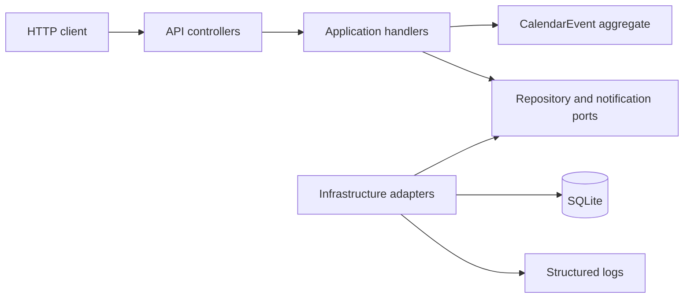

# Architecture

This document describes the current implementation. Claims are **Observed** from code, configuration, or tests unless explicitly labelled **Inferred** or **Recommended**.

## Purpose and scope

Appointment Scheduler is an ASP.NET Core HTTP API for a doctor's-practice calendar. An API consumer can create, list, filter, search, replace, soft-cancel, and respond to events. Each event owns one or more attendees.

Inputs are JSON request bodies, route identifiers, and list query parameters. Outputs are JSON event representations, `application/problem+json` errors, a local SQLite database, and structured notification log entries.

Observed external dependencies are:

- a SQLite file configured by `ConnectionStrings:SchedulerDatabase`;
- ASP.NET Core logging through `ILogger`;
- HTTP callers using the API or Development-only Swagger UI.

There is no frontend, authentication scheme, authorization policy, external notification service, message broker, cache, migration set, background worker, or deployment definition in the repository. Generated client distribution and production documentation hosting are also outside the current implementation.

## System shape

| Boundary | Location | Responsibility | Dependencies |
| --- | --- | --- | --- |
| API | `src/AppointmentScheduler.Api`, `Program.cs`, `Controllers/`, `Events/`, `ErrorHandling/` | HTTP contracts, routing, model validation, response mapping, exception handling, OpenAPI, composition | Application and Infrastructure |
| Application | `src/AppointmentScheduler.Application` | Use-case orchestration and persistence/notification ports | Domain |
| Domain | `src/AppointmentScheduler.Domain` | Event aggregate, attendee entity, lifecycle rules, invariants | .NET runtime only |
| Infrastructure | `src/AppointmentScheduler.Infrastructure` | EF Core/SQLite repository and logging notification adapter | Application and Domain |
| Tests | `tests/AppointmentScheduler.Tests` | Domain, application, infrastructure, and HTTP integration verification | All production projects |

Project references enforce the main dependency direction: Domain has no project reference; Application references Domain; Infrastructure references Application and Domain; the API references Application and Infrastructure.

`Program.cs` is the composition root. It registers controllers, Problem Details, `ApiExceptionHandler`, OpenAPI, the five use-case handlers, and Infrastructure. Handlers, `SchedulerDbContext`, `IEventRepository`, and `IEventNotificationPublisher` are scoped. Startup opens a scope and calls `EnsureCreatedAsync`; startup fails if database initialization fails.

## Runtime flows

### Create an event

1. `POST /api/events` binds `CreateEventRequest`. `[ApiController]` and data annotations reject missing/malformed bodies, invalid email format, lengths, and an empty attendee collection. `EventsController.Create` explicitly rejects null collection entries.
2. The controller maps the request to `CreateEventCommand` and calls `CreateEventHandler.HandleAsync`.
3. `CalendarEvent.Create` trims required text, normalizes times to UTC, verifies `end > start`, creates attendee IDs, validates email addresses, and enforces case-insensitive email uniqueness.
4. `EfEventRepository.AddAsync` adds the aggregate and calls `SaveChangesAsync`. EF persists the event and owned attendees in one `SaveChanges` transaction.
5. After persistence, the handler publishes a `Created` `EventNotification`. `LoggingEventNotificationPublisher` records type, event ID, and recipient count; it does not deliver externally or log addresses.
6. The controller returns 201 with generated event/attendee IDs and version 1. It does not return a `Location` header.

If persistence fails, notification publication is not attempted. If publication fails, the event remains saved and the centralized handler returns 500.

### List, filter, and search

1. `GET /api/events` accepts `from`, `to`, `search`, and `includeCancelled`.
2. `ListEventsHandler` normalizes date filters to UTC, trims search text, and rejects `to < from`.
3. `EfEventRepository.ListAsync` uses an `AsNoTracking` query. Active events are the default. Date filtering uses inclusive overlap: `EndTime >= from` and `StartTime <= to`. Search uses SQLite `LIKE` over title and description.
4. Results are ordered by start time and then ID. EF materializes the owned attendees, and the controller returns 200.

### Mutate an existing event

`PUT`, attendance `PATCH`, and `DELETE` load a tracked aggregate with attendees through `GetByIdAsync`.

- Update and attendance compare the request version with the loaded version before changing state. Domain methods reject updates to cancelled events; update replaces the complete attendee collection; attendance changes one owned attendee.
- State-changing update, attendance, and first cancellation increment `CalendarEvent.Version`. An attendance no-op does not save, increment, or notify. Cancellation is idempotent and a repeated request also does not save or notify.
- `Version` is an EF concurrency token. The application check catches stale clients; the EF check catches a database race between load and save. `EfEventRepository` translates `DbUpdateConcurrencyException` to `EventConcurrencyException`.
- Successful changes are saved before an `Updated` or `Cancelled` notification is published. Update returns 200; attendance and cancellation return 204.

There is no authentication or authorization step in any flow. `UseAuthorization` is present, but no authentication service, `[Authorize]` attribute, or policy is configured; all routes are anonymous.

## Domain and data model

`CalendarEvent` is the aggregate root. `Attendee` is owned by the event and cannot be created or changed publicly outside aggregate operations.

Material invariants:

- title and description are required, trimmed, and limited to 200 and 2,000 characters;
- at least one attendee is required;
- attendee name and email are required, trimmed, and limited to 200 and 320 characters;
- email must round-trip through `MailAddress.TryCreate` and be unique within an event, case-insensitively;
- end time must be later than start time;
- stored times are UTC;
- cancelled events cannot be updated or have attendance changed;
- event version starts at 1 and increments on actual state changes.

EF maps `CalendarEvent` to `Events` and its owned collection to `Attendees`. IDs are application-generated GUIDs. The attendee table has an `EventId` foreign key and a unique index on `(EventId, EmailAddress)`. `StartTime` and `EndTime` are stored as UTC ticks (`INTEGER`). `Version` is required and marked as a concurrency token.

There are no migrations or seed data. `EnsureCreatedAsync` creates a fresh schema and does not upgrade an older database. The default file, `appointment-scheduler.db`, persists across restarts and is ignored by Git.

## Cross-cutting behaviour

### Security and trust boundaries

The API trusts any network caller because authentication and authorization are absent. HTTPS redirection runs outside Development; the checked-in HTTP launch profile uses `http://localhost:5158`. No CORS policy, rate limiting, encryption-at-rest feature, or application-level protection for attendee personal data is configured. The notification adapter avoids logging attendee addresses.

### Validation and errors

Request binding and data annotations run at the API boundary. Domain invariants run again in `CalendarEvent`, so non-HTTP callers cannot bypass the central rules. `ApiExceptionHandler` maps:

- domain/query validation to 400;
- missing events to 404;
- stale/racing writes to 409;
- unexpected exceptions to a generic 500 containing a trace ID.

Unexpected exceptions are logged server-side. `UseStatusCodePages` creates Problem Details for otherwise empty error responses, including unmatched routes. Startup failures are not converted to HTTP because the application never starts.

### Time, configuration, and diagnostics

All input offsets are converted to UTC in the domain or list handler. SQLite stores ticks and materializes `DateTimeOffset` values at offset zero.

Configuration uses normal ASP.NET Core sources. Checked-in settings contain the SQLite connection string, logging levels, and `AllowedHosts`; no runtime secrets are required by the current implementation. The connection string can be overridden with `ConnectionStrings__SchedulerDatabase`.

There is no caching, retry policy, health endpoint, metrics exporter, distributed trace setup, or external delivery telemetry. Logging covers framework activity, unexpected exceptions, and simulated notification events.

## Testing architecture

The xUnit test project uses four levels:

- Domain tests call the aggregate directly for validation and lifecycle rules.
- Application tests use focused fakes and in-memory SQLite to verify persistence, notification content, and save-before-publish ordering.
- Infrastructure tests use SQLite to verify concurrency and logging behavior.
- API tests use `WebApplicationFactory<Program>` with a unique temporary SQLite file, exercising the HTTP pipeline, model binding, DI, persistence, Swagger, and Problem Details.

Injected repository/save/publisher failures prove error propagation, safe Production 500 responses, and that notifications do not run after failed saves. Tests also prove that a publisher failure occurs after persisted data.

The suite does not prove authentication, authorization, migrations, external notification delivery, browser CORS behavior, load/performance, multi-instance operation, backup/restore, or a deployed production configuration because those capabilities are absent.
