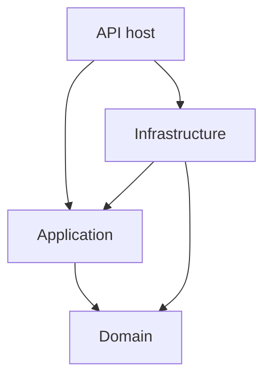
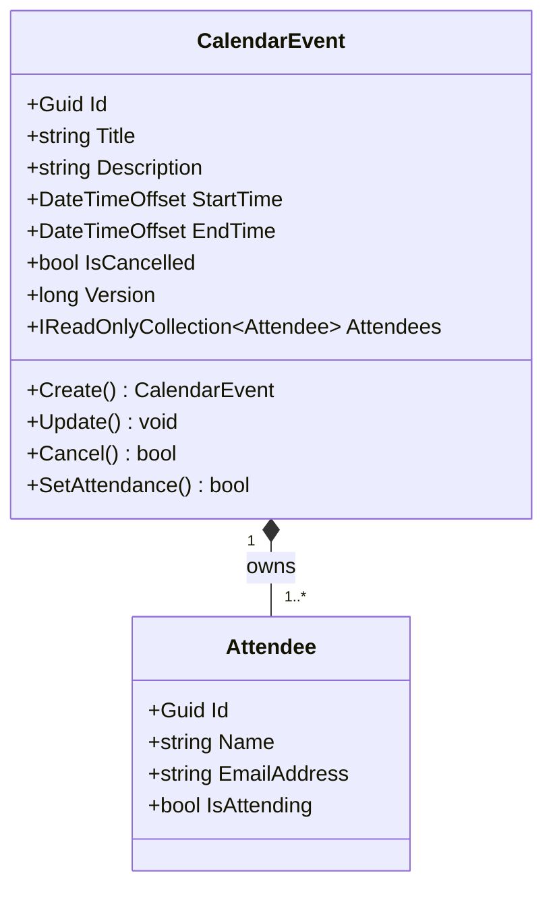
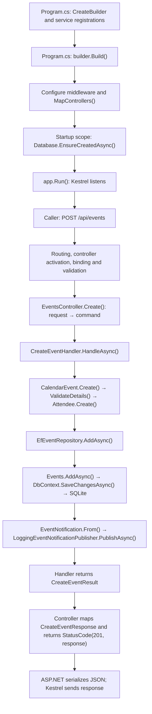
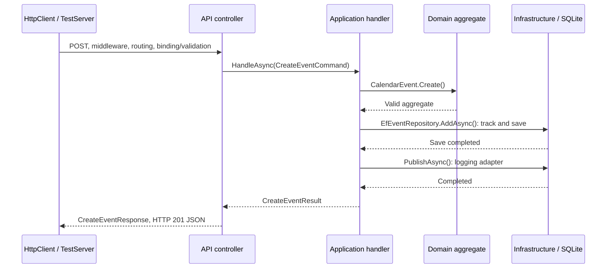

# Appointment Scheduler — consolidated technical reference

Prepared 2 October 2026; learning priorities reconciled 5 October 2026 against the technical-review and earlier professional assessments. This revision uses the supplied `01-TECHNICAL_REFERENCE.md` as its base. Implementation claims retain their 2 October source-check status; the code and tests were not rechecked for this revision.

## Contents

1. [Scope, evidence and documentation inventory](#1-scope-evidence-and-documentation-inventory)
2. [Solution boundaries and dependency direction](#2-solution-boundaries-and-dependency-direction)
3. [Startup, dependency injection and middleware](#3-startup-dependency-injection-and-middleware)
4. [Domain entities, aggregate ownership and validation](#4-domain-entities-aggregate-ownership-and-validation)
5. [HTTP contract and response semantics](#5-http-contract-and-response-semantics)
6. [Complete runtime call paths](#6-complete-runtime-call-paths)
7. [EF Core, SQLite and query execution](#7-ef-core-sqlite-and-query-execution)
8. [Concurrency, idempotency and independent attendee responses](#8-concurrency-idempotency-and-independent-attendee-responses)
9. [Notifications and consistency](#9-notifications-and-consistency)
10. [Error handling, asynchronous calls and cancellation](#10-error-handling-asynchronous-calls-and-cancellation)
11. [OpenAPI, Swagger UI and generated clients](#11-openapi-swagger-ui-and-generated-clients)
12. [Tests and the real application pipeline](#12-tests-and-the-real-application-pipeline)
13. [Material decisions, alternatives and costs](#13-material-decisions-alternatives-and-costs)
14. [Extensions: security, migrations and Docker](#14-extensions-security-migrations-and-docker)
15. [Prioritized improvements and source-navigation map](#15-prioritized-improvements-and-source-navigation-map)
16. [Sources and references](#16-sources-and-references)
17. [Exercise: foundational concepts](#17-exercise-foundational-concepts)
18. [Exercise: decisions and alternatives](#18-exercise-decisions-and-alternatives)
19. [Exercise: predict behaviour](#19-exercise-predict-behaviour)
20. [Exercise: change impact](#20-exercise-change-impact)
21. [Exercise: demonstrate understanding and track uncertainties](#21-exercise-demonstrate-understanding-and-track-uncertainties)
22. [Evidence-informed learning priorities](#22-evidence-informed-learning-priorities)

## 1. Scope, evidence and documentation inventory

The application is a .NET 10 ASP.NET Core HTTP API for calendar events in a doctor's practice. It supports creating, listing/filtering/searching, replacing, cancelling and recording attendance responses. It has no frontend.

The domain has `CalendarEvent` and `Attendee`, with no separate reservation/booking, patient, doctor, room, practice/tenant or availability model. Event creation does not reserve an exclusive slot or prevent overlaps.

### How to read claims

- **Current implementation:** verified in source, configuration or selected tests on 2 October 2026.
- **Recorded rationale:** documented in the assessment-day worklog, without attributing independent authorship.
- **Static risk:** inferred from code; not reproduced in this session.
- **Proposed extension:** absent from the submitted implementation.

The README/worklog record a clean build and **56 passing tests**. These were not rerun because `dotnet` was unavailable. The historical submitted commit and deployment were not independently verified.

### Existing documentation: role and reconciliation

| Document | Purpose |
| --- | --- |
| `NET Technical Test.pdf` | Authoritative employer brief. |
| `ASSESSMENT.md` | Searchable requirements and email clarifications; Must/Should/Could scope. |
| `README.md` | Build/run commands, request examples and endpoint contract. |
| `WORKLOG.md` | Historical decisions and execution evidence; some final-status claims are stale. |
| `ARCHITECTURE.md` | Structure, runtime behaviour and tests. |
| `IMPLEMENTATION_GUIDE.md` | Source locations, workflows and debugging. |
| `DECISIONS_AND_LIMITATIONS.md` | Decision costs, guarantees and future work. |
| `AGENTS.md` | Internal assessment-agent guidance; historical context, not runtime behaviour. |

This guide consolidates their technical explanations. The requirements brief and source code remain authoritative.

### Requirement status in context

| Priority | Item | Actual implementation |
| --- | --- | --- |
| Must | Event/attendee fields, limits, create/update/cancel/list/filter/search, appropriate tests | Implemented, with the correctness limitations described below. |
| Must | Notification capability | Orchestration, a message contract and a logging simulation exist; external delivery is absent. Fulfilment of the broad requirement is not unequivocal. |
| Explicit design | Storage, layering, abstractions/interfaces, DDD | Four production boundaries with EF Core/SQLite and an event aggregate. |
| Should | OpenAPI and generated API documentation | OpenAPI JSON and Swagger UI in Development; production/public hosting absent. |
| Should | Generated third-party client | Not implemented. |
| Should | Accept/reject | Boolean attendance PATCH; no richer invitation lifecycle. |
| Could | Concurrent updates | Numeric event version plus EF optimistic concurrency; detection, not conflict resolution. |
| Could | Availability/advanced features | Not implemented. |

The brief permits partial delivery and values decisions, assumptions, documentation and runnable progress. Migrations, authentication and Docker were not mandatory.

## 2. Solution boundaries and dependency direction

### Project responsibilities

| Project | Main files and responsibility | Project dependencies |
| --- | --- | --- |
| `src/AppointmentScheduler.Api` | `Program.cs`; `src/AppointmentScheduler.Api/Controllers/EventsController.cs`; HTTP contracts; `ApiExceptionHandler`; host configuration and OpenAPI | Application, Infrastructure; Domain types are also accessible through the dependency graph. |
| `src/AppointmentScheduler.Application` | Use-case handlers, commands/results, persistence and notification interfaces | Domain |
| `src/AppointmentScheduler.Domain` | `Events/CalendarEvent.cs`: aggregate and business rules; `Events/Attendee.cs` and `Events/AttendeeDetails.cs` define attendee types | No other solution project |
| `src/AppointmentScheduler.Infrastructure` | EF repository/context, SQLite configuration and logging adapter | Application and Domain |
| `tests/AppointmentScheduler.Tests` | Domain, application, infrastructure and HTTP tests | Production projects |

The root is **a Web API executable**, using `Microsoft.NET.Sdk.Web` and targeting `net10.0`.

Controllers handle routes, binding, model validation, status codes and response types. `ApiExceptionHandler` converts exceptions into HTTP Problem Details. Both belong at the API boundary, keeping HTTP concerns outside business rules and persistence.

### Compile-time project dependencies

Arrows mean “references/depends on,” not “executes next.”



At runtime handlers call interfaces implemented by injected infrastructure objects, without an Application → Infrastructure project reference.

### Dependency inversion versus dependency injection

**Dependency inversion:** Application owns contracts such as `IEventRepository`; Infrastructure implements them. Use cases therefore depend on contracts rather than EF classes.

**Dependency injection:** the host supplies those implementations through constructors. For example, `AddInfrastructure` registers `EfEventRepository` for the `IEventRepository` required by `CreateEventHandler`. The notification publisher follows the same pattern.

Handlers are called directly, without MediatR, a command bus, generic repository or domain-event dispatcher. Separate read/write handlers do not establish full CQRS.

### Layers versus vertical slices

Layers separate responsibilities; a delivery slice crosses them to complete one operation. The create slice includes controller, command, handler, domain creation, persistence and tests.

## 3. Startup, dependency injection and middleware

### What `Program.cs` does, in order

| Stage | Actual call | Effect |
| --- | --- | --- |
| Create host builder | `WebApplication.CreateBuilder(args)` | Establish host/configuration/service-registration facilities. |
| Register API services | `AddControllers`, `AddProblemDetails`, `AddExceptionHandler<ApiExceptionHandler>`, `AddOpenApi` | Enable controllers, API error handling and document generation. |
| Register use cases | Five `AddScoped<...Handler>()` calls | Make handlers available to controller construction. |
| Register infrastructure | `AddInfrastructure(connectionString)` | Register SQLite context, repository and notification adapter. |
| Build app | `builder.Build()` | Build the host/service provider; this does not yet begin listening. |
| Configure request pipeline | `UseExceptionHandler`, `UseStatusCodePages`, environment branches, `UseAuthorization` | Configure shared HTTP behaviour. |
| Register controller endpoints | `MapControllers()` | Map controller route/action metadata. |
| Initialize database | `CreateAsyncScope` → `GetRequiredService<SchedulerDbContext>()` → `Database.EnsureCreatedAsync()` | Create a fresh database/schema if necessary before starting the host. |
| Run host | `app.Run()` | Start the application and normally listen through Kestrel until shutdown. |

`public partial class Program;` exposes the generated top-level program type for `WebApplicationFactory<Program>` tests.

### How controllers obtain handlers

ASP.NET Core activates `EventsController`, resolving its five primary-constructor handler parameters and their repository/publisher dependencies.

Handler registrations include:

```csharp
builder.Services.AddScoped<CreateEventHandler>();
builder.Services.AddScoped<UpdateEventHandler>();
```

Infrastructure registrations live in **`src/AppointmentScheduler.Infrastructure/DependencyInjection.cs`**, called by `Program.cs`:

```csharp
services.AddDbContext<SchedulerDbContext>(options => options.UseSqlite(connectionString));
services.AddScoped<IEventRepository, EfEventRepository>();
services.AddScoped<IEventNotificationPublisher, LoggingEventNotificationPublisher>();
```

Handlers, repository, publisher and context are scoped: one context instance per ordinary request scope. Startup uses a separate scope. `DbContext` is not thread-safe.

**Lifetime distinction:** transient means a new instance per resolution; scoped means reuse within a scope; singleton means reuse for the container's lifetime. A singleton must not retain this scoped repository/context: its lifetime would exceed the intended scope and requests could share mutable tracking state. A background worker should create a scope for each unit of work, then resolve and dispose its scoped dependencies there.

### What middleware means here

Middleware components form the HTTP pipeline. Each can process the request, call the next component, process the returning response or stop the chain.

| Explicit pipeline configuration | Responsibility |
| --- | --- |
| `UseExceptionHandler()` | Catch downstream exceptions and invoke registered exception handling. |
| `UseStatusCodePages(...)` | Write Problem Details for eligible otherwise-empty HTTP error responses. This is a custom inline delegate, not just a default call. |
| `UseSwaggerUI(...)` | Serve interactive documentation in Development. |
| `UseHttpsRedirection()` | Redirect HTTP to HTTPS outside Development when hosting is suitably configured. |
| `UseAuthorization()` | Evaluate authorization metadata; this project provides no protected routes/policies. |
| `MapControllers()` | Register controller endpoints; this is endpoint mapping, not interchangeable with middleware registration. |

Minimal hosting supplies routing infrastructure. **Routing selects an endpoint before authorization evaluates its metadata.** Model binding/validation occurs during controller execution. `MapControllers` registers endpoints; its position in startup is not a literal per-request execution step.

### Development and Production

| Behaviour | Development | Non-Development |
| --- | --- | --- |
| Calendar endpoints | Available | Available |
| OpenAPI endpoint `/openapi/v1.json` | Mapped | Not mapped |
| Swagger UI `/swagger/index.html` | Enabled | Not enabled |
| HTTPS redirection | Not added | Added |
| Generic unexpected-error responses | Enabled | Enabled |
| Authentication/access restrictions | Absent | Absent |

The HTTP launch profile sets Development at `http://localhost:5158`. Hosting variables include `ASPNETCORE_ENVIRONMENT` and `DOTNET_ENVIRONMENT`; check precedence if both are set. Production mode alone supplies no authentication, certificates, proxy or delivery guarantees.

Configuration is read from normal .NET providers. The SQLite setting is `ConnectionStrings:SchedulerDatabase`; its environment-variable form is `ConnectionStrings__SchedulerDatabase`.

## 4. Domain entities, aggregate ownership and validation

`CalendarEvent`, `Attendee`, and `AttendeeDetails` each have a matching file under **`src/AppointmentScheduler.Domain/Events/`**. `ValidatedEventDetails` remains private inside `CalendarEvent`.



### Aggregate root

An aggregate groups domain objects within one consistency boundary. Callers make changes through its root: here, `CalendarEvent` owns attendees and exposes `SetAttendance(attendeeId, isAttending)`.

Properties have private setters, constructors are private, and attendee creation/mutation is internal. `_attendees` is exposed through a read-only interface, which restricts normal access but does not make the underlying collection immutable.

EF owned types express this design in persistence. DDD requires neither EF ownership nor recreated attendee IDs; requirements can justify different boundaries.

### Invariants and lifecycle

| Rule | Current enforcement |
| --- | --- |
| Required title/description | API annotations and Domain `RequiredText` |
| Title ≤ 200; description ≤ 2,000 characters | API and Domain; EF model also records lengths |
| Required attendee name/email; name ≤ 200, email ≤ 320 | API and Domain |
| Valid email | API email annotation; Domain `MailAddress.TryCreate` and address comparison |
| At least one attendee | API Required/MinLength plus Domain collection/count validation |
| Null attendee entries | Explicit create/update controller check; do not assume every direct domain caller is protected identically |
| Unique attendee emails within event, ignoring case | Domain grouping with `StringComparer.OrdinalIgnoreCase` |
| End later than start | Domain compares normalized UTC instants |
| Cancelled events cannot update/change attendance | Domain methods |
| Attendee must belong to event | `CalendarEvent.SetAttendance` lookup |
| Event version | Starts at 1; increments during successful state-changing domain operations |

`Create` validates before constructing an event and assigns a new GUID. `ValidateDetails` calls `Attendee.Create`, which assigns each attendee a new GUID.

`Update` rejects cancelled state, validates the entire replacement, then assigns properties, clears/rebuilds the attendee collection and increments the version. **Validation precedes mutation**, avoiding partly applied updates when validation fails.

Even an identical PUT recreates attendee IDs and increments the version; unchanged replacements are not detected.

`Cancel` returns `false` if already cancelled. The handler then skips save and notification. `SetAttendance` returns `false` if the existing boolean matches; its handler also skips save/notification. The attendance version check occurs before this no-op decision, so an already-stale request still receives 409.

### Timestamp-presence gap — static risk

Create/update contracts use non-nullable `DateTimeOffset StartTime` and `EndTime` without explicit required-presence enforcement or JSON required-constructor configuration. Omission can produce a default value. A missing start with a valid later end may therefore satisfy `end > start` while storing a year-0001 start.

Binding can reject malformed/null timestamps without detecting omission. Proposed remedies: nullable required fields or JSON-required metadata/configuration, plus omission tests. Field presence and valid business dates are separate rules.

`SetAttendanceRequest` deliberately uses `[Required] bool?` to distinguish omission/null from explicit `false`. Create/update attendee `IsAttending` is a non-nullable boolean, so omission defaults to false; the model cannot distinguish pending invitation from rejection.

## 5. HTTP contract and response semantics

Routes live in **`src/AppointmentScheduler.Api/Controllers/EventsController.cs`**; contracts for all operations live in **`src/AppointmentScheduler.Api/Events/`**.

| Request | Controller action | Application method | Successful response |
| --- | --- | --- | --- |
| `GET /api/events` | `List` | `ListEventsHandler.HandleAsync` | 200 plus event array |
| `POST /api/events` | `Create` | `CreateEventHandler.HandleAsync` | 201 plus `CreateEventResponse` |
| `PUT /api/events/{id}` | `Update` | `UpdateEventHandler.HandleAsync` | 200 plus `UpdateEventResponse` |
| `DELETE /api/events/{id}` | `Cancel` | `CancelEventHandler.HandleAsync` | 204, no body |
| `PATCH /api/events/{eventId}/attendees/{attendeeId}/attendance` | `SetAttendance` | `SetAttendanceHandler.HandleAsync` | 204, no body |

There is no public `GET /api/events/{id}`. `GetByIdAsync` is an internal repository lookup used for mutations. Clients currently list events and find the relevant ID.

**200 OK** signals success with the requested or updated representation. **201 Created** signals creation of a resource. **204 No Content** signals success without a response body; it does not mean nothing happened.

A representation is the JSON form of event data exposed to callers. List returns several; create returns the new event with generated IDs and version.

The creation action actually uses:

```csharp
return StatusCode(StatusCodes.Status201Created, response);
```

It does **not** call `Created()` and does not set a `Location` header. A single-event GET plus `CreatedAtAction` would provide a clearer discoverable resource location.

### DTO boundaries

HTTP request → application command/query → domain data → application result → HTTP response DTO. This keeps HTTP annotations/status handling outside Domain and persistence types out of the consumer contract, at the cost of repeated mapping.

Examples: `CreateEventRequest`, `CreateEventCommand`, `AttendeeDetails`, `CreateEventResult`, `CreateEventResponse`. These messages/results are not separate persistent entities.

Example creation body:

```json
{
  "title": "Consultation",
  "description": "Annual review",
  "startTime": "2026-10-05T09:00:00Z",
  "endTime": "2026-10-05T09:30:00Z",
  "attendees": [{ "name": "Alex", "emailAddress": "alex@example.com", "isAttending": false }]
}
```

Attendance body uses the latest event version:

```json
{ "isAttending": true, "version": 1 }
```

## 6. Complete runtime call paths

Startup runs once; handlers run per request. Creation follows this chain; reads use the separate query path below.

### Startup to creation and response



File locations along this chain:

| Class/member | File relative to repository root |
| --- | --- |
| Host composition/startup | `Program.cs` |
| `EventsController.Create` and response mapping | `src/AppointmentScheduler.Api/Controllers/EventsController.cs` |
| HTTP create contracts | `src/AppointmentScheduler.Api/Events/` |
| Create handler, commands/results | `src/AppointmentScheduler.Application/Events/Create/` (one type per file) |
| `CalendarEvent.Create`, `ValidateDetails`, `Attendee.Create` | `src/AppointmentScheduler.Domain/Events/CalendarEvent.cs` and `Attendee.cs` |
| `EfEventRepository.AddAsync` | `src/AppointmentScheduler.Infrastructure/Persistence/EfEventRepository.cs` |
| Context/model | `src/AppointmentScheduler.Infrastructure/Persistence/SchedulerDbContext.cs` |
| Notification contract and `EventNotification.From` | `src/AppointmentScheduler.Application/Events/Notifications/IEventNotificationPublisher.cs` |
| Logger adapter | `src/AppointmentScheduler.Infrastructure/Notifications/LoggingEventNotificationPublisher.cs` |

`EfEventRepository.AddAsync` both adds **and saves**. EF's `DbSet.AddAsync` alone normally tracks the new object; it is the following `SaveChangesAsync` that persists it. Creation calls the context save directly, while mutation handlers use the repository's save wrapper.

### Listing, filtering and searching

Caller GET → Kestrel/pipeline → `EventsController.List` → `ListEventsHandler.HandleAsync` → normalize filters/build `EventQuery` → `EfEventRepository.ListAsync` → build no-tracking LINQ query → `ToListAsync` executes against SQLite → handler maps `ListedEventResult[]` → controller maps `EventListItemResponse[]` → `Ok(...)` → JSON/HTTP 200.

Reads materialize stored entities without domain mutation or notifications.

### Full update

Caller PUT → `EventsController.Update` maps request → `UpdateEventHandler.HandleAsync` → `GetByIdAsync` loads tracked event/attendees → reject missing event or mismatched request version → `CalendarEvent.Update` validates/replaces/increments version → repository `SaveChangesAsync` → EF save-time check/SQLite transaction → publish `Updated` → return `UpdateEventResult` → controller `Ok(UpdateEventResponse)` → HTTP 200.

### Attendance response

Caller PATCH → `EventsController.SetAttendance` → `SetAttendanceHandler.HandleAsync` → tracked lookup/version check → `CalendarEvent.SetAttendance` → if changed, save and publish `Updated` → controller `NoContent()` → HTTP 204. An unchanged answer skips save/publication; stale version is checked first.

### Cancellation

Caller DELETE → `EventsController.Cancel` → `CancelEventHandler.HandleAsync` → tracked lookup → `CalendarEvent.Cancel` → if first cancellation, save and publish `Cancelled` → controller `NoContent()` → HTTP 204. Repetition returns 204 without another write or notification. No client version is supplied for cancellation.

## 7. EF Core, SQLite and query execution

### Model mapping

`SchedulerDbContext.OnModelCreating` defines:

| Mapping | Meaning |
| --- | --- |
| `Events` table; event GUID key; `ValueGeneratedNever()` | IDs come from the application, not database generation. |
| `OwnsMany(event => event.Attendees)` | Attendees are owned children for EF persistence. |
| `Attendees` table; attendee GUID primary key | Ownership does not require sharing the parent's table. |
| `WithOwner().HasForeignKey("EventId")` | Owner key is an EF shadow property; `Attendee` has no public `EventId` property. |
| Unique index on `(EventId, EmailAddress)` | Additional per-event uniqueness constraint with SQLite's configured/default collation. |
| Navigation `PropertyAccessMode.Field` | EF works through the `_attendees` backing field, while consumers use aggregate operations. |
| `Version.IsConcurrencyToken()` | Originally loaded version participates in update/delete concurrency checks. |
| UTC tick converter for start/end | Store date instants as integer values suitable for filtering/order. |

The Domain enforces case-insensitive email uniqueness. Do not assume the default SQLite unique index has identical case-insensitive semantics. Likewise, `HasMaxLength` documents EF model intent; SQLite does not automatically enforce every length facet like a server database. Domain/API length validation remains important.

### Shadow foreign key: `EventId`

An **EF shadow property** exists in the EF model without a corresponding C# property or backing field on the entity. EF keeps its value in the change tracker; when mapped to a relational column, the database stores that value normally.

Here, `WithOwner().HasForeignKey("EventId")` defines the attendee-to-event foreign key. EF obtains the owning event ID from the configured relationship and writes it to the `Attendees.EventId` column. `Attendee` therefore needs no `EventId` member, while the database still has the foreign key. This keeps the persistence linkage out of the domain class; it is a modelling choice, not a DDD requirement.

For a tracked attendee, inspect the value through EF:

```csharp
var eventId = context.Entry(attendee).Property<Guid>("EventId").CurrentValue;
```

This is an inspection example, not an additional implementation method. An untracked attendee does not carry the shadow value itself. Within translated LINQ queries, `EF.Property<Guid>(attendee, "EventId")` can reference it.

Reference: [EF Core shadow properties](https://learn.microsoft.com/en-us/ef/core/modeling/shadow-properties).

### UTC tick conversion

```csharp
new ValueConverter<DateTimeOffset, long>(
    value => value.UtcTicks,
    value => new DateTimeOffset(value, TimeSpan.Zero));
```

Writes normalize instants to UTC; the converter stores 100-nanosecond ticks relative to the .NET date epoch, not Unix seconds. Reading returns offset zero. The original offset and named scheduling time zone are not preserved. A future recurrence/local-calendar model would need an explicit time-zone policy.

### Tracking and transactions

`GetByIdAsync` includes attendees and uses tracking because a mutation follows. EF remembers original values, including the original version, and detects changed objects at save time. The aggregate can increment its current version without losing EF's original concurrency value.

`ListAsync` uses `AsNoTracking` to avoid tracking overhead while still materializing results. Its redundant `AsQueryable` call does not load data; execution waits for `ToListAsync`.

The normal EF save transaction makes the related event/attendee writes atomic. Notification publication is outside that transaction. No separate unit-of-work abstraction or explicit cross-system transaction is implemented.

### Filter semantics and execution

The handler converts date filters to UTC, trims search, turns whitespace-only search into null, and rejects `to < from`.

- Default: exclude cancelled events.
- `from`: retain events with `EndTime >= from`.
- `to`: retain events with `StartTime <= to`.
- Search: SQLite `LIKE` with `%search%` over title OR description.
- Order: UTC start then event ID.

Filters use **inclusive overlap**: spanning events and those touching a boundary match.

LINQ builds the query; `ToListAsync` executes/materializes it before the handler maps results. The owned attendees are materialized with the events. Listing is unpaginated. `%` and `_` in supplied search text act as LIKE wildcards because they are not escaped. SQLite's default LIKE case behaviour should not be generalized to all Unicode characters or every other database provider.

### Schema creation

`EnsureCreatedAsync` supports initializing a fresh schema, not evolving an old one. There are no EF migrations or seed data. Existing database files persist across restarts. If the model changes, use a new database file for study or explicitly back up/reset the old one; schema-upgrade support was deliberately deferred.

## 8. Concurrency, idempotency and independent attendee responses

### Two checks protect different intervals

1. **Application check:** request version versus loaded event version. Rejects an already-stale client with an application concurrency exception.
2. **EF check:** database version versus EF's originally loaded version at save. Rejects a competing write that won after this request loaded the event.

Conceptually, the event update resembles:

```sql
UPDATE Events
SET Version = @newVersion, /* other changed fields */
WHERE Id = @id AND Version = @originalVersion;
```

If the row no longer matches, EF raises `DbUpdateConcurrencyException`. `EfEventRepository.SaveChangesAsync` converts it into `EventConcurrencyException`; the API maps that to 409. This SQL is illustrative, not a captured statement from this session.

The manually incremented `long` detects conflicts; it is neither a database-generated `rowversion` nor a lock.

Both checks matter: loading the latest row gives EF its latest version, so EF alone cannot recognize a stale client submission.

### Two attendees accepting one group event

Suppose two callers hold version 1 of the same event, and each wants to accept for a different attendee. If both changes reach the normal versioned path, the first committed change increments the event to version 2; the other is rejected either at the handler check or at save time. In the ordinary optimistic-conflict case the outcomes are **204 and 409**, even though the intended attendee changes are independent.

The shared version determines conflict, not wall-clock timing. SQLite busy/locking errors under contention can produce other outcomes.

The trade-off is **aggregate-wide conflict granularity**. It prevents silent overwrite but can unnecessarily force one attendee to refresh/retry. Proposed alternatives include attendee-level versioning, a targeted conditional update with carefully retained aggregate rules, or a controlled merge/retry policy for independent changes. Changing aggregate boundaries requires considering event cancellation and membership consistency.

An event-wide ETag/If-Match retains the same conflict granularity. UI live updates improve freshness but cannot replace server-side checks.

### Concurrency is not duplicate-create protection

Each POST creates a new event GUID. Sending the same body again can create another row. Event versioning does not connect these requests.

**Idempotency** means repeating the same logical operation does not apply its effect twice. The existing DELETE is idempotent at the domain/application level. POST has no idempotency key, request record, client operation ID or deduplication guarantee.

A proposed POST idempotency implementation would associate a client-supplied operation key with the request and its stored result, enforcing uniqueness atomically. Return/reuse the earlier result for a repeated equivalent operation and reject inappropriate key reuse. This complements reliable notification delivery; neither mechanism alone solves every failure scenario.

## 9. Notifications and consistency

Application handlers call **`IEventNotificationPublisher.PublishAsync`**, implemented by the infrastructure logger. `EventNotification.From` captures type, event ID, title, start/end and current attendee email recipients.

| Trigger | Notification |
| --- | --- |
| Successful create | Created |
| Successful full update | Updated |
| Changed attendee attendance | Updated |
| First cancellation | Cancelled |
| Repeated cancellation or unchanged attendance | None |
| Failed save | None |

Current messages target the current event attendee list, including those whose attendance is false; there is no per-channel preference/history logic. Removed attendees are not retained in the current message snapshot.

The logger records type, ID and recipient count, not addresses. It returns `Task.CompletedTask`; there is no background worker, email/iCalendar delivery, queue or external provider.

`EventNotification` is an application message, with no domain-event dispatcher or outbox. An external adapter alone would not guarantee durable delivery.

### Save first, then publish

This ordering prevents a notification claiming an unsaved change. It has the following guarantees and gaps:

| Outcome | Stored event | Notification | HTTP result |
| --- | --- | --- | --- |
| Domain validation fails | No change saved | Not called | 400 |
| Save fails | Save transaction unsuccessful | Not called | Error, normally generic 500 or mapped 409 |
| Save succeeds; publisher succeeds | Change committed | Current adapter logs invocation | 201/200/204 |
| Save succeeds; publisher throws | Change remains committed | Failed/uncertain | Generic 500 |

The final row is tested using an injected failing publisher. Retrying creation after that 500 can create another event. Retrying update with the old version may get 409. The HTTP response therefore does not always describe whether persistence happened.

Retry/backoff can improve eventual delivery but does not automatically make the request atomic or preserve notification intent across process failure. A domain event alone also does not solve durability. Cancelling an appointment because email failed would be a separate business/compensation decision, not a default transaction fix.

### Proposed transactional outbox

1. Save the event change and a durable outgoing-notification record in the same database transaction.
2. Return success for the accepted/persisted operation, with a contract that distinguishes pending notification from delivered notification if needed.
3. A worker reads pending records, sends messages and tracks attempts/outcomes.
4. Retry transient errors with bounded backoff; monitor permanent failure.
5. Make dispatch/consumption idempotent where possible because delivery can be retried after an ambiguous outcome.

The outbox protects the atomic relationship between data and notification intent. It does not promise exactly-once external delivery and does not replace idempotency for repeated POST requests.

## 10. Error handling, asynchronous calls and cancellation

`ApiExceptionHandler.TryHandleAsync` is registered in `Program.cs` and invoked through exception middleware. It is not the same mechanism as normal model validation, which can return 400 before the action runs.

| Exception/condition | Current public response |
| --- | --- |
| API validation failure | 400 validation Problem Details |
| `DomainValidationException` | 400 with coarse `event` error key |
| `InvalidEventQueryException` | 400 with `dateRange` key |
| `EventNotFoundException` | 404 |
| `EventConcurrencyException` | 409 |
| Unexpected exception | Generic 500 plus trace ID; details logged server-side |
| Eligible otherwise-empty error status, such as unmatched route | Status-code delegate writes Problem Details |

The trace ID correlates responses with logs; audit history and distributed tracing are absent. Startup failures occur before listening and bypass HTTP exception handling.

### Async and CancellationToken

Controllers/handlers/repository use `Task`-based async calls for database and publisher boundaries. `await` allows the caller to wait without blocking a request thread during suitable asynchronous I/O; it does not automatically create another thread or make an operation a background job. Domain validation remains synchronous.

The controller's cancellation token is passed through handlers into EF/publisher calls. Cancellation is cooperative and does not undo an already-committed write. The logging adapter currently does not inspect it. Once notification and persistence are separated, request cancellation and durable background delivery need an explicit policy. The current exception handler does not provide a special cancellation branch.

## 11. OpenAPI, Swagger UI and generated clients

| Component | Function here |
| --- | --- |
| ASP.NET controllers | Implement the actual API behaviour. |
| OpenAPI document | Standard machine-readable description of routes, schemas, methods, parameters and responses. |
| Swagger UI | Human-facing browser interface that reads the document and allows manual calls. |
| Generated typed client | Proposed source code wrapping HTTP calls with typed methods/models; absent from this solution. |

`builder.Services.AddOpenApi()` registers generation. `app.MapOpenApi()` maps the document endpoint in Development. `UseSwaggerUI` points at `/openapi/v1.json`; controller annotations contribute response metadata. The recorded document is OpenAPI 3.1.1.

Controllers work without OpenAPI or Swagger UI. Consumers then need another contract description; typed generation needs an equivalent machine-readable input.

A generator such as NSwag turns OpenAPI into C# DTOs and HTTP-call methods, for example `await client.CreateEventAsync(request)`. This illustrative method is absent from the solution; generated names depend on configuration and operation IDs.

NSwag was only a provisional choice. Delivery would require generated source, pinned/repeatable configuration, a compiled example and contract-compatibility checks. Regenerate rather than hand-edit generated files; NuGet publishing depends on distribution requirements.

## 12. Tests and the real application pipeline

### Boundary-based testing

| Test boundary | What it demonstrates | What it does not establish alone |
| --- | --- | --- |
| Domain | Direct aggregate invariants/lifecycle | HTTP binding or relational provider behaviour |
| Application | Use-case orchestration, notification content/order with fakes and selected SQLite tests | External notification delivery |
| Infrastructure | Relational SQLite mapping/query/concurrency and logger behaviour | Multi-process/load guarantees |
| API integration | HTTP routing, activation, binding, serialization, errors and actual persistence | Deployed networking/TLS/browser behaviour |

In-memory **SQLite** is still the relational SQLite engine. It is different from EF Core's non-relational InMemory provider. Keeping an open connection is important for the lifetime of an in-memory SQLite database.

### Integration creation flow



`ApiFactory : WebApplicationFactory<Program>` lives in **`tests/AppointmentScheduler.Tests/Api/ApiFactory.cs`**.

`CreateClient()` initializes the host when needed and connects HttpClient to TestServer. The real middleware, controllers, DI, handlers, domain, repository and serializer execute, without Kestrel socket listening.

`ApiFactory.ConfigureWebHost` removes the original `DbContextOptions<SchedulerDbContext>` registration and configures SQLite at a unique temporary file path with pooling disabled. Tests can additionally replace repository/publisher registrations to inject failures. Disposing the factory disposes the host, clears pools and deletes its temporary database file.

**Isolation is per factory**, not automatically per request or every test method. `IClassFixture<ApiFactory>` shares a factory across tests in a class; changing data assumptions requires care. Startup's `EnsureCreatedAsync` also executes against the test database.

Deployed calls use Kestrel and the configured persistent database. TestServer does not validate proxies, certificates, browser CORS or production infrastructure.

### Representative tests and their limits

| Actual test | Meaning |
| --- | --- |
| `CreateEventEndpointTests.Post_creates_event_and_returns_created_response` | Checks 201, returned IDs/attendees and a persisted event/attendee query. |
| `CreateEventEndpointTests.Post_rejects_invalid_time_range_without_persisting` | Checks 400; despite its name, does not assert unchanged database state. |
| `EventLifecycleEndpointTests.Put_returns_conflict_when_the_supplied_version_is_stale` | Exercises stale version rejection through HTTP. |
| `EventLifecycleEndpointTests.Patch_attendance_updates_the_attendee_and_event_version` | Exercises attendance/version changes. |
| `EventConcurrencyTests.Save_rejects_the_second_writer_loaded_at_the_same_version` | Two contexts load one version, mutate, then save sequentially; second save raises mapped conflict. Not simultaneous request/load testing. |
| `ErrorHandlingTests.Notification_failure_propagates_as_500_after_data_has_been_saved` | Injects a failing publisher, checks 500 and confirms one stored event. Documents a limitation. |
| `ErrorHandlingTests.Save_failures_propagate_without_publishing_notifications` | Tests failure mapping and suppression of publication using injected failures. |

Coverage gaps include timestamp presence, attendee-ID continuity, length edges and independent-attendee contention. The suite does not validate absent features such as authentication, migrations or real delivery.

## 13. Material decisions, alternatives and costs

Summary of benefits and costs; detailed behaviour appears in the preceding sections.

| Choice | Recorded purpose / benefit | Cost or alternative |
| --- | --- | --- |
| Four projects | Make required layering/DDD dependencies explicit | More files/mappings; folders could suit a smaller prototype. |
| Aggregate owns attendees | Centralize event/attendee validity | Coarse concurrency; distinct invitation lifecycles may justify a different model. |
| Narrow repository/publisher ports | Substitute persistence/delivery and test orchestration | Indirection must retain a useful boundary; generic wrappers are unnecessary. |
| SQLite | Easy relational setup without installing a server | File/write/multi-instance limitations; PostgreSQL or another server DB for suitable deployments. |
| UTC integer storage | Provider-friendly chronology/filtering | Discards original offset/zone context. |
| EnsureCreated | Quick fresh-database setup | No schema evolution; migrations later. |
| Full replacement PUT | Simple complete input and validation | New attendee identities; stable-ID reconciliation is preferable where consumers retain references. |
| Soft cancellation | Preserve stored state; harmless repetition | Not an audit trail; every query must handle cancelled data. |
| Logging notification | Observable boundary without external setup | No actual delivery guarantee. |
| Save then notify | Never notify after an unsuccessful save | Persisted change can accompany 500; outbox/idempotency needed for reliability. |
| Shared numeric version | Prevent unnoticed stale/racing writes | Conflicts for independent attendee changes; no merge/retry. |
| Centralized errors | Consistent transport handling, lean controllers | Coarse error keys, no stable error-code catalogue. |
| Development-only documentation | Familiar template convention and limited exposure | Fails to provide production/public documentation by itself. |
| Vertical-slice delivery | Keep progress runnable/testable | Slice breadth must remain understandable; completion alone is not engineering ownership. |

## 14. Extensions: security, migrations and Docker

All material in this section describes **proposed work**, not submitted functionality.

### Authentication and authorization

Authentication establishes identity; authorization checks permission. These endpoints are currently anonymous. Implementation tasks:

1. Define roles, practice/tenant ownership and event/attendance permissions before choosing policies.
2. Integrate an identity provider and configure token validation, commonly `AddAuthentication().AddJwtBearer(...)` in the API host, with appropriate issuer/audience/signature checks.
3. Register policies through `AddAuthorization(...)` and add authentication middleware before authorization. Both belong after routing selection and before endpoint execution.
4. Protect actions with `[Authorize]`/policies. A token alone must not permit arbitrary attendee/event changes.
5. Expose trusted caller information through an Application abstraction such as `ICurrentUser`, with an API implementation reading validated claims. Keep JWT/HttpContext out of Domain.
6. Introduce tenant/owner data where required. Apply resource checks and query constraints to prevent cross-practice reads/writes. Never trust a client-provided tenant ID merely because it is present.
7. Configure OpenAPI's security scheme/UI token entry; that improves documentation, not actual enforcement.
8. Test missing/invalid credentials (401), insufficient permission (403, or an intentional concealment policy), permitted access and cross-tenant denial.

Define audit, privacy/retention, logging, secrets and access to stored attendee details.

### Migrations and operations

Introduce EF migrations for versioned schema changes and a deliberate deployment process for applying them. Do not treat adding `MigrateAsync` to an existing EnsureCreated database as an automatic conversion. Plan data preservation/baselining or rebuild for the specific database, and test upgrades/rollback expectations.

Production also needs database selection, backups/recovery, secrets, TLS termination, health/readiness, telemetry, alerting and CI/CD.

### Docker outline for this solution

Containerization packages the same application; it does not change its logical layers or solve state/notification reliability.

1. Add a multi-stage Dockerfile: .NET 10 SDK stage restores/builds/publishes `src/AppointmentScheduler.Api/AppointmentScheduler.Api.csproj` with all referenced projects; ASP.NET 10 runtime stage runs the published output.
2. Entry point: `dotnet AppointmentScheduler.Api.dll`. Configure listening on container port 8080; `EXPOSE 8080` documents the port but does not publish it to the host.
3. Add `.dockerignore` for build/IDE output, local databases and other unnecessary context. Keep required project/source files.
4. Configure `ConnectionStrings__SchedulerDatabase=Data Source=/data/appointment-scheduler.db` and mount `/data` as a persistent volume. The volume alone does not relocate the default database path.
5. Ensure the container user can create/write the database in `/data`.
6. Decide on environment and TLS/reverse-proxy configuration. The current non-Development HTTPS redirect requires attention when exposing a plain internal HTTP port.
7. Optionally add Compose for reproducible build, port mapping, environment and volume settings; smoke-test against a fresh volume.

Illustrative commands **after creating/testing the image and hosting configuration**:

```sh
docker build -t appointment-scheduler .
docker run -p 8080:8080 \
  -e ASPNETCORE_HTTP_PORTS=8080 \
  -e 'ConnectionStrings__SchedulerDatabase=Data Source=/data/appointment-scheduler.db' \
  -v scheduler-data:/data \
  appointment-scheduler
```

No Dockerfile/image exists in the submitted solution. A persistent volume survives container replacement, not necessarily deletion of the volume. Multiple API replicas would normally use a shared server database rather than independently mounted SQLite files.

## 15. Prioritized improvements and source-navigation map

### Improve the delivered behaviour first

| Area | Proportionate next change |
| --- | --- |
| Timestamp presence | Explicit presence validation and omission tests. |
| Attendee identity | Preserve stable IDs when updating existing attendees; specify matching/removal rules. |
| Duplicate creates and notification failure | Separate POST idempotency from notification durability; define responses and implement an outbox/worker if required. |
| Group-event attendance concurrency | Specify whether independent responses should conflict; test and refine granularity. |
| Test precision | Add actual non-persistence assertions and tests for correctness risks, not just more cases. |
| HTTP resource discovery | Add appropriate single-event retrieval and creation Location header. |
| Requirement completion | Generate and verify a typed client; decide on deliberate documentation access and actual notification delivery. |
| Read scaling | Pagination, wildcard policy, index/search review and realistic query measurements. |
| Production needs | Identity/resource authorization, migrations, operational guarantees and deployment. |
| Documentation hygiene | Remove internal submission instructions when appropriate; repair stale worklog claims. |

Add availability, recurrence and richer invitations only for explicit requirements. The unfinished Should client should be weighed against optional concurrency refinements.

### Navigation while studying source

| Question/change | Read first | Then inspect |
| --- | --- | --- |
| How does the host start/wire services? | `Program.cs` | Infrastructure `DependencyInjection.cs`, API csproj, launch settings |
| How does POST work? | `EventsController.Create` | `CreateEventHandler` → `CalendarEvent.Create` → repository Add/save → publisher |
| Why did validation fail? | Response errors / request contracts | Controller null checks → Domain `ValidateDetails`/`RequiredText` |
| Why 404? | Handler lookup | Repository `GetByIdAsync`; route match versus missing entity |
| Why 409? | Request version / handler comparison | Domain increment → context token → repository save catch |
| Why 500 after apparent success? | Trace ID/server log | Save/publication boundary; injected-failure tests |
| How is data mapped? | `SchedulerDbContext.OnModelCreating` | Domain properties/backing field; SQLite provider behaviour |
| Where does filtering execute? | `ListEventsHandler` | `EfEventRepository.ListAsync` and `ToListAsync` |
| Where does accept/reject live? | `EventsController.SetAttendance` | Handler → aggregate attendee lookup/mutation |
| How do HTTP tests use the app? | `ApiFactory.cs` in `tests/AppointmentScheduler.Tests/Api/` | TestServer, DI replacements and temporary SQLite lifecycle |

Local commands recorded by the README, from the repository root:

```powershell
dotnet restore AppointmentScheduler.slnx
dotnet build AppointmentScheduler.slnx --no-restore
dotnet test AppointmentScheduler.slnx --no-build --no-restore
dotnet run --project src/AppointmentScheduler.Api/AppointmentScheduler.Api.csproj --no-build --launch-profile http
```

Use `--no-build` after a successful build of the intended current source. Startup URL: `http://localhost:5158`; Development Swagger: `/swagger/index.html`; OpenAPI: `/openapi/v1.json`. For schema experiments, a separate database file avoids destroying existing study data.

## 16. Sources and references

Alongside the documents inventoried in section 1, source inspection covered the host/project file, controller/contracts/exception handler, five handlers, both ports, aggregate, EF context/repository, infrastructure DI/logger and selected HTTP/concurrency tests. Corrections to earlier explanations are incorporated in the relevant sections.

Primary framework references:

- [ASP.NET Core middleware](https://learn.microsoft.com/en-us/aspnet/core/fundamentals/middleware/?view=aspnetcore-10.0)
- [EF Core concurrency conflicts](https://learn.microsoft.com/en-us/ef/core/saving/concurrency)
- [EF Core SQLite provider limitations](https://learn.microsoft.com/en-us/ef/core/providers/sqlite/limitations)
- [System.Text.Json required properties and constructor parameters](https://learn.microsoft.com/en-us/dotnet/standard/serialization/system-text-json/required-properties)
- [ASP.NET Core integration tests](https://learn.microsoft.com/en-us/aspnet/core/test/integration-tests?view=aspnetcore-10.0)

## 17. Exercise: foundational concepts

These exercises use the inspected code and assessment requirements. Section 22 incorporates the completed interview assessment and relevant earlier evidence; the separate source-selection report records provenance and limits.

**For a future assignment, answer each section independently before consulting worked answers or AI.** Use that project's source evidence. Work untimed: answer → locate evidence → predict → verify → revise. Record reference/AI assistance in section 21.

### Questions and worked answers

| Question to answer independently | Answer for this project | Source anchor |
| --- | --- | --- |
| Why is the API project an HTTP host and the others libraries? | Web SDK and `Program.cs` compose/run ASP.NET Core; the libraries supply behaviour without listening independently. | Sections 2–3; API csproj, `Program.cs` |
| How does a controller obtain handlers? | DI resolves constructor dependencies recursively. Registrations choose implementations; lifetimes control reuse. | Section 3; constructor, Infrastructure `DependencyInjection.cs` |
| Why not make the handler/repository singleton? | They depend on a request-scoped, mutable, non-thread-safe context. Longer-lived capture breaks the intended lifetime boundary. | Section 3; registrations and `SchedulerDbContext` |
| How can Application call EF persistence without referencing Infrastructure? | It calls `IEventRepository`; the host injects `EfEventRepository`. Runtime calls differ from project references. | Section 2; interface and implementation |
| What separates middleware, controller, handler and aggregate? | Shared HTTP behaviour; transport mapping; use-case coordination; business rules, respectively. | Sections 3 and 6; request chain |
| Why validate in API and Domain? | API checks the input contract; Domain protects business rules outside HTTP too. Their current checks are not identical. | Section 4; contracts, null checks, `ValidateDetails` |
| Does changing a tracked object immediately change SQLite? | No: saving persists changes. `DbSet.AddAsync` only tracks; this repository's `AddAsync` also saves. | Sections 6–7; repository, context |
| What does the aggregate boundary buy and cost? | Centralized event/attendee rules, with coarse conflicts from the shared event version. | Sections 4 and 8; `CalendarEvent`, mapping |
| Does awaiting publication imply background or durable delivery? | No: this adapter logs and returns a completed task. Durability needs storage/dispatch mechanisms. | Sections 9–10; publisher |
| Does cancelling the HTTP request reverse a save? | No. Tokens request cooperative cancellation; a committed database change remains committed. Identify the exact stage reached. | Sections 9–10; save and publication order |

**Deliverable:** explain one write and contrast GET, locating the actual methods.

## 18. Exercise: decisions and alternatives

**Questions:** Which requirement does each choice serve? What alternative and cost did you accept? What would make you reconsider? Is the rationale recorded or inferred?

### Worked decision review

| Decision | Defensible explanation here | Alternative and reconsideration trigger |
| --- | --- | --- |
| Four project boundaries | Express the brief's layering/DDD through separated responsibilities and dependencies. | Folders reduce ceremony when separate projects add little isolation. |
| Narrow repository | Application-oriented persistence operations and substitution. | Direct EF simplifies a small app but couples orchestration to EF/provider details. An interface must justify its boundary. |
| SQLite with `EnsureCreated` | Runnable relational storage without server setup; upgrades deferred. | Shared deployment and schema evolution can justify server DB/migrations; neither was mandatory. |
| Full-replacement update | Straightforward validation and mutation. | Preserve IDs when clients retain attendee references; recreation is not a DDD requirement. |
| Save before notification | Avoids announcing a failed save. | Outbox for durable intent; direct delivery retains a post-save failure gap. |
| Shared event version | Prevents stale overwrites. | Independent responses may justify finer concurrency or controlled merge, subject to consistency rules. |

**Scope:** partial delivery and documented compromises were permitted; a preference for less breadth is unproven. The client was an unfinished Should item and delivery was simulated (section 1).

**Deliverable:** requirement → choice → alternative → cost → evidence → reconsideration trigger. Label recorded rationale versus later interpretation.

## 19. Exercise: predict behaviour

**Questions:** What response, stored state and side effects result? Where does execution diverge? Is the prediction tested, inferred or uncertain?

### Worked predictions

| Scenario | Expected behaviour and reason | Evidence / verification |
| --- | --- | --- |
| PUT supplies an old version | 409 before aggregate mutation; no save/publication. | Handler comparison; stale-version HTTP test in section 12 |
| Another writer commits after this request loads the event | EF version check fails; repository maps conflict, normally 409. No publication. | Section 8; two-context save test, not simultaneous HTTP load |
| Identical PUT with current version | Recreated attendee IDs, incremented version, save and Updated publication. | `CalendarEvent.Update`; verify IDs/version/message |
| Different attendees accept using the same event version | Shared version can cause 204/409 despite independent changes; SQLite contention can cause other errors. | Section 8; actual request outcomes need a contention test |
| Publisher fails after successful POST save | Client gets 500 but the event remains stored. Repeating the POST can create a duplicate. | Failure test in section 12; no POST idempotency mechanism |
| Attendance answer is unchanged | Current version: 204, no save/publication. Stale version: 409; version check precedes no-op detection. | `SetAttendanceHandler.HandleAsync`, aggregate |
| Start omitted, end valid | Default start may pass validation; unexecuted static risk. | Section 4; test omission separately from malformed/null input |
| Query touches an event boundary | Inclusive overlap can match; no mutation/publication. | Section 7; predicates |

**Deliverable:** predict before execution; record observations and explain mismatches. Prioritize consequential cases.

## 20. Exercise: change impact

Proposed exercises; the code is unchanged.

### A. Preserve attendee identity during event updates

**Questions:** How is an existing attendee identified? What distinguishes additions, edits and removals? Should attendance survive an update? What happens to an ID belonging to another event?

**Answer:** accept optional existing IDs, validate membership/duplicates, update matching children and generate IDs for additions. Specify removal and attendance-preservation rules. Validate before mutation; retain version checks.

**Impact:** update matching contract files under `src/AppointmentScheduler.Api/Events/Update/`, controller/command mapping, `UpdateEventHandler.cs` and `CalendarEvent.cs`. Responses already expose IDs; verify EF child reconciliation.

**Verify:** retained/new IDs, rejected foreign/duplicate IDs, removal/attendance semantics, invalid-input non-mutation and stale conflicts. Test child persistence relationally.

### B. Add single-event retrieval and a creation Location header

**Questions:** What does GET by ID return for missing or cancelled events? Can the existing repository lookup be reused safely? How will a client follow the creation response?

**Answer:** add a read handler/result and GET route; define cancelled/missing-event behaviour. Existing tracked `GetByIdAsync` can support the read; consider no-tracking support. Map the representation and use `CreatedAtAction` for POST.

**Impact:** Application, controller/contracts, DI and possibly repository. **Verify:** 200/404, representation/version and a resolvable creation Location.

### C. Protect events by practice and caller permission

**Questions:** Where does trusted identity come from? Which caller may list, edit, cancel or answer attendance? Does knowing an event ID grant access? How do you prevent cross-practice queries?

**Answer:** authenticate in the API and apply endpoint policies. Supply trusted caller/resource context to Application; add practice/ownership data and enforce query/mutation permissions. `[Authorize]` alone cannot enforce ownership. Keep JWT/HttpContext outside Domain.

**Impact:** section 14; current tenancy data is absent. **Verify:** anonymous/invalid callers, permitted operations, insufficient permission and cross-practice denial. Decide 403 versus concealed 404.

**Deliverable:** requirement → affected files → rules → failure cases → minimal change → verification. Start with one small change.

## 21. Exercise: demonstrate understanding and track uncertainties

**Questions:** Can you explain, locate, predict and revise the code? What remains unknown, and how will you check it?

### Interpreting the evidence

| Observation | What it supports | What it does not establish |
| --- | --- | --- |
| Recognition when reading an existing structure | Practical familiarity | Independent design ability |
| Correct explanation with source/reference support | Understanding supported by references | Fast unaided recall under questioning |
| Correct prediction before execution | A usable model of behaviour | Mastery of all related framework mechanisms |
| Small change completed with meaningful verification | Transferable understanding of that change | Broad senior-role readiness |
| Blank or scattered interview answer | Difficulty demonstrating understanding in that exchange | Whether the cause was knowledge, communication, anxiety or a combination |
| Fluent use of pattern names | Vocabulary familiarity | Correct application or trade-off reasoning |

AI was permitted; assess ownership through explanation, prediction and revision. Learning route and years of experience alone establish neither ability nor deficiency.

### Reusable answer/evidence record

Complete for each selected topic:

| Field | What to record |
| --- | --- |
| Question and initial answer | Your explanation before consulting an answer key. |
| Source anchors | Actual files/methods/configuration supporting it. |
| Assumptions and unknowns | Precisely what you cannot yet establish. |
| Prediction | Expected response, state and side effects for one changed condition. |
| Verification | Test, trace or small code revision and its observed result. |
| Assistance used | What came from references or AI; what you independently checked. |
| Revised explanation | Corrected reasoning and the cause of any mismatch. |
| Next action | One remaining question, or enough evidence to move on. |

Explain **behaviour → mechanism → trade-off → evidence**. State uncertainty and the next check; distinguish rationale from retrospective justification.

### 80/20 order for using this guide

1. **Trace a write:** `UpdateEventHandler` through DI, validation, mutation, tracking, save, concurrency and publication; contrast GET.
2. **Predict:** stale version, identical PUT and post-save notification failure.
3. **Defend choices:** boundaries, storage, attendee identity and consistency; separate assessment and production scope.
4. **Revise:** implement and verify one small change.
5. **Investigate:** resolve exposed gaps before broadening scope.

After studying this submission, use a different domain/rules to test transfer, adding selected interview scenarios. The new assignment remains deferred.

## 22. Evidence-informed learning priorities

**Purpose:** choose what to verify independently, not assign an overall competency grade. The actual review supplies current observations; earlier practice answers and project records help identify recurrence. Repeated summaries of one episode count once. Source choices and counterevidence are recorded in `Assessment-Source-Selection-and-Reconciliation.md`.

**Future exercise:** answer the questions below for a new assignment before consulting worked answers or AI. Use section 21's evidence record. These are investigation priorities, not assertions that every underlying skill is absent.

| Priority / evidence | Question to answer independently | Answer or verification target in this project |
| --- | --- | --- |
| **1. State and guarantees:** review 13:21–21:48 | What survives each failure, and what happens on retry? | POST can save, fail publication and return 500. Repeating POST can duplicate the event; update versioning does not prevent this. Predict stored rows, response and messages separately. Sections 8–9, 19. |
| **2. Preserve the scenario:** review 21:52–24:52 | What is shared, what changes independently, and which invariant is protected? | Two attendees change separate answers but share one event version. A stale request conflicts; this is not competition for an exclusive slot. Compare both loaded-before-save and loaded-after-save cases. Section 8. |
| **3. Runtime mechanics:** practice T2–T3; review 29:09–31:09 | Can I distinguish dependency direction, object lifetime, asynchronous waiting and cancellation? | Draw project references separately from runtime calls; identify scoped context ownership; trace the token past save. No automatic background work or rollback follows from `await` or cancellation. Sections 2–3, 10, 17. |
| **4. Behavioural proof:** practice T6; earlier Beqom closure findings | What assertion would disprove my claim? Which sibling paths also need it? | The invalid-time HTTP test asserts 400 but not unchanged storage. Add a database assertion to prove its name. For conflict guarantees, check state and non-publication as well as 409; use real EF/SQLite for persistence behaviour. Sections 12, 19. |
| **5. Ownership and scope:** review 07:37–10:55; earlier assisted-project findings | Can I explain and revise this choice, and identify what remains unverified? | Complete one change from section 20, stating affected contracts, rules, persistence and tests before editing. Explain what four projects buy relative to folders; distinguish the brief's requirements from later production extensions. Sections 13, 18, 20. |

### Check the whole behaviour without widening the assignment

Earlier records repeatedly found one correct path with missed sibling paths. For each rule, make a small **operation × state** checklist: create, update, attendance and cancellation against valid, invalid, stale and unchanged input. Mark genuinely inapplicable cases. Record response, stored state and publication; do not assume all operations should behave identically.

**Worked contrast:** unchanged attendance with the current version returns 204 without save/publication; identical full PUT recreates attendee IDs, increments the version and publishes. A shared “updates are harmless when unchanged” explanation would be wrong (sections 4, 19).

### Distinguish a repair from an explanation

**Question:** what observation separates my proposed cause from a plausible alternative? A passing test or an error disappearing after an edit proves only the observed result. For example, a handler's early version rejection does not exercise EF's save-time concurrency check; the two-context persistence test addresses that different interval. Name the mechanism before claiming coverage.

### Use the strengths; verify transfer

Earlier records support persistence, contextual debugging, challenging incorrect assumptions and careful written explanation. Apply those strengths to one bounded result: explain → predict → check → revise. A clear written/source-supported explanation is useful evidence, but does not establish unaided implementation or concise spoken delivery. Conversely, interview blanking does not erase demonstrated practical work.

**First checkpoint:** explain post-save notification failure, locate the relevant methods and test, and predict a repeated POST before running anything. Then identify the smallest additional assertion needed. Record assistance and remaining uncertainty; continue untimed.
